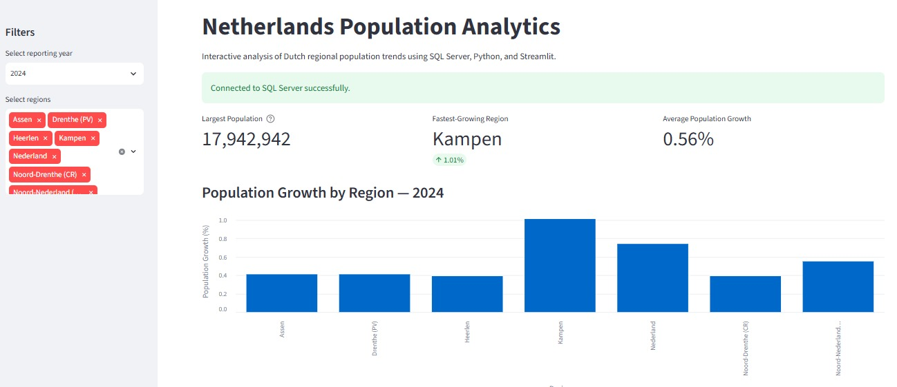
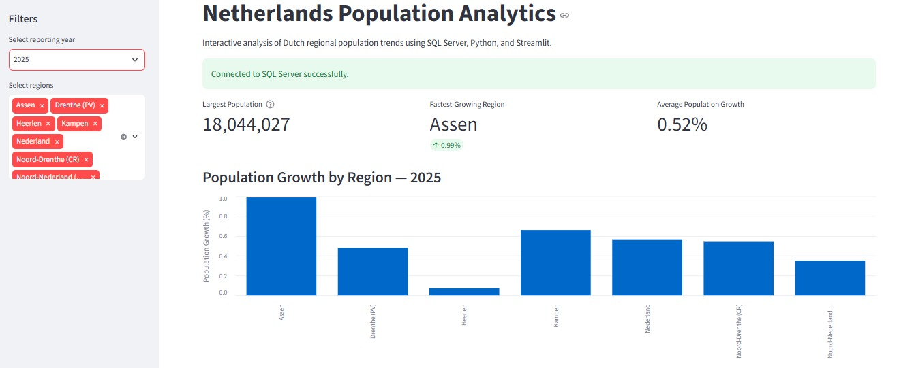

# Netherlands Housing Analytics

A SQL Server portfolio project that demonstrates how Dutch open population data can be imported, cleaned, validated, analyzed, and prepared for reporting.

The project uses public CBS data and follows a layered database structure with separate schemas for raw data, staging, analytics, and data quality.

## Project Overview

This project analyzes regional population trends in the Netherlands for the years 2023 to 2025.

The analysis focuses on:

- Total population by region and year
- Annual population growth
- Population growth percentages
- Regional growth rankings
- Male and female population distribution
- Data quality validation
- Query performance
- Reusable views and stored procedures

The current dataset contains a selected group of Dutch regions and municipalities. The project structure can be extended to include all Dutch municipalities and additional CBS datasets.

## Business Questions

This project answers questions such as:

- How has the population changed by region over time?
- Which regions experienced the highest annual population growth?
- What percentage of the population is male or female?
- Are there duplicate, missing, or inconsistent population records?
- How can population-growth results be reused in reporting tools?
- How can SQL Server query performance be measured?

## Data Source

The data was downloaded from CBS StatLine:

- Source: Statistics Netherlands, CBS
- Dataset: Regionale kerncijfers Nederland
- File format: CSV without statistical symbols
- Reporting period used: 2023–2025

The original CBS file was imported into the `raw` schema before selected columns were loaded into the staging layer.

## Technology

- Microsoft SQL Server
- SQL Server Management Studio 22
- Visual Studio Code
- Git
- GitHub
- CBS Dutch Open Data

## Database Architecture

The project uses four SQL Server schemas:

| Schema | Purpose |
|---|---|
| `raw` | Stores the original imported CBS data |
| `staging` | Stores cleaned and structured population data |
| `analytics` | Stores reporting views and stored procedures |
| `quality` | Stores reusable data-quality checks |

### Data Flow

```text
CBS CSV file
    ↓
raw.cbs_regionale_kerncijfers
    ↓
staging.population_summary
    ↓
analytics views and stored procedures
    ↓
reporting and analysis

## Streamlit Dashboard

The project includes an interactive Streamlit dashboard built on top of the SQL Server analytical layer.

### 2024 Dashboard



### 2025 Dashboard

